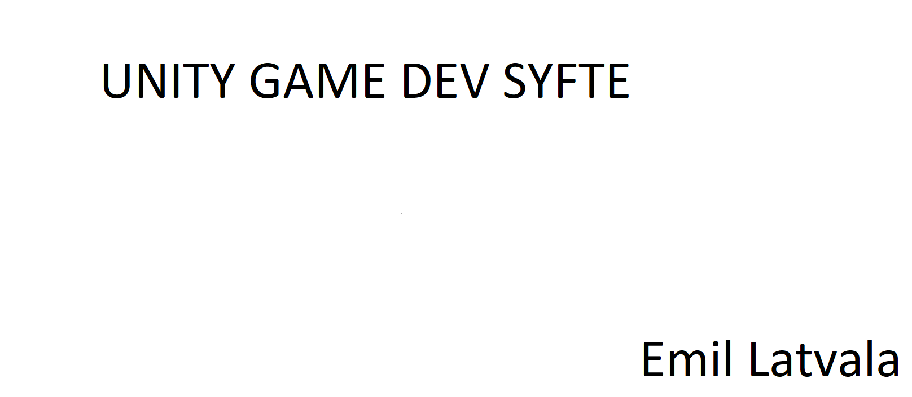

# **Här får du resurser för att göra ett Unity spel.**

## **Menyer**
Här är 5 meny tutorials som är enkla att följa. Väsentliga menyer som man kan ha i ett spel.

| Video&nbsp; &nbsp; &nbsp; &nbsp; &nbsp; &nbsp; &nbsp; &nbsp; &nbsp; &nbsp; &nbsp; &nbsp; &nbsp; &nbsp; | Beskrivning                                                        |
| -------------------------------------------------------------------------------------------------------- | ------------------------------------------------------------------ |
| [Kredit meny](https://www.youtube.com/watch?v=cj6hwCjiVZE)                                                | En snabb och enkel tutorial på en skrollande kredit "scene"          |
| [Start meny](https://www.youtube.com/watch?v=zc8ac_qUXQY)                                                 | Snabb start meny tutorial.                                           |
| [Paus meny](https://www.youtube.com/watch?v=JivuXdrIHK0)                                                  | Enkel paus meny tutorial att följa.                                  |
| [Inställningar meny](https://www.youtube.com/watch?v=YOaYQrN1oYQ)                                         | Bra meny för spel inställningarna.                                   |
| [Nivå Väljar meny](https://www.youtube.com/watch?v=vpbPd6jNEBs)                                           | En snabb tutorial på en nivå väljare.                                |

## **Plugins**
Här är 5 plugins till unity som kan vara bra att ha för att göra ett spel.

| Plugins&nbsp; &nbsp; &nbsp; &nbsp; &nbsp; &nbsp; &nbsp; &nbsp; &nbsp; &nbsp; &nbsp; &nbsp; &nbsp; &nbsp; | Beskrivning                                                        |
| -------------------------------------------------------------------------------------------------------- | ------------------------------------------------------------------ |
| [DOTween](https://assetstore.unity.com/packages/tools/animation/dotween-hotween-v2-27676)                                  | Snabb och gratis objekt-orienterad animation engine.       |
| [Rewired *(40.20€)*](https://assetstore.unity.com/packages/tools/utilities/rewired-21676)                                  | Enklare att optimisera användning till t.ex Joystick.      |
| [Master Audio *(44.67€)*](https://assetstore.unity.com/packages/vfx/shaders/fullscreen-camera-effects/colorful-fx-44845)   | En mer avancerad "Audio mixer" för unity.                  |
| [Colorful FX *(35.73€)*](https://assetstore.unity.com/packages/vfx/shaders/fullscreen-camera-effects/colorful-fx-44845)    | Snabb och anpassbar för "post-processing" effekter.        |
| [Easy Mobile Pro *(79.51€)*](https://assetstore.unity.com/packages/tools/integration/easy-mobile-pro-75476)                | Innehåller för funktioner för mobilspel t.ex "In-app-purchase" och notifikationer. |

## **Ljudeffekter**
Här är 5 gratis ljudeffekter beroende vad för spel man håller på göra.

| Ljudeffekter&nbsp; &nbsp; &nbsp; &nbsp; &nbsp; &nbsp; &nbsp; &nbsp; &nbsp; &nbsp; &nbsp; &nbsp; &nbsp; &nbsp; | Beskrivning                                                        |
| -------------------------------------------------------------------------------------------------------- | ------------------------------------------------------------------ |
| [Fotsteg](https://assetstore.unity.com/packages/audio/sound-fx/foley/footsteps-essentials-189879)         | Olika sorters fotsteg på olika ytor.                            |
| [Fordon](https://assetstore.unity.com/packages/audio/sound-fx/transportation/vehicle-essentials-194951)   | Flera olika ljud för fordon.                                    |
| [Naturen](https://assetstore.unity.com/packages/audio/ambient/nature/nature-essentials-208227)            | Ljud från naturen från en massa olika platser.                  |
| [Retroljud](https://assetstore.unity.com/packages/audio/sound-fx/retro-game-sfx-60365)                    | Några retrostil ljud.                                           |
| [Granatljud](https://assetstore.unity.com/packages/audio/sound-fx/grenade-sound-fx-147490)                | Har en massa granat och explosions ljud.                        |

## **2D GUI**
Här är 5 gratis GUI beroende på hurudan tema man har på spelet.

| Ljudeffekter&nbsp; &nbsp; &nbsp; &nbsp; &nbsp; &nbsp; &nbsp; &nbsp; &nbsp; &nbsp; &nbsp; &nbsp; &nbsp; &nbsp; | Beskrivning                                                        |
| -------------------------------------------------------------------------------------------------------- | ------------------------------------------------------------------ |
| [2D Casual UI HD](https://assetstore.unity.com/packages/2d/gui/icons/2d-casual-ui-hd-82080)         | Knappar till nivåer, social medie och valutor                         |
| [Sci-fi GUI skin](https://assetstore.unity.com/packages/2d/gui/sci-fi-gui-skin-15606)               | Sci-fi liknande knappar osv.                                   |
| [Naturen](https://assetstore.unity.com/packages/audio/ambient/nature/nature-essentials-208227)            | Ljud från naturen från en massa olika platser.                  |
| [Retroljud](https://assetstore.unity.com/packages/audio/sound-fx/retro-game-sfx-60365)                    | Några retrostil ljud.                                           |
| [Granatljud](https://assetstore.unity.com/packages/audio/sound-fx/grenade-sound-fx-147490)                | Har en massa granat och explosions ljud.                        |

### test 123

#### test 123